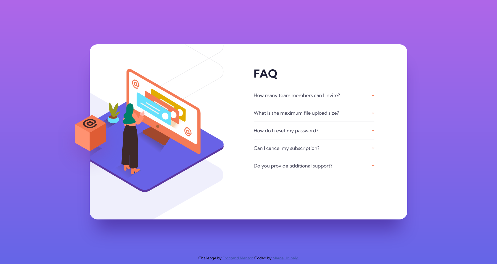
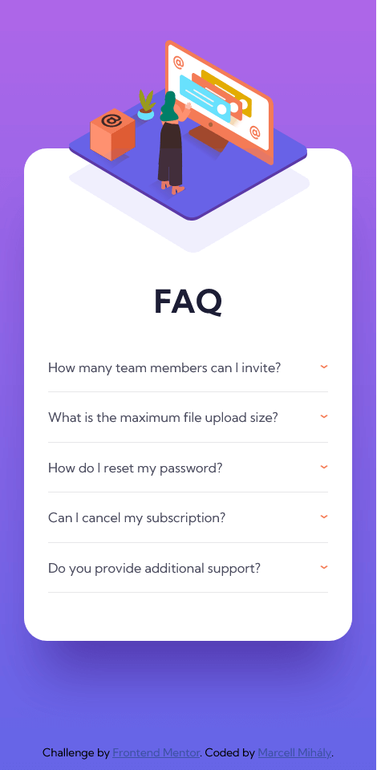

# Frontend Mentor - FAQ accordion card solution

This is a solution to the [FAQ accordion card challenge on Frontend Mentor](https://www.frontendmentor.io/challenges/faq-accordion-card-XlyjD0Oam). Frontend Mentor challenges help you improve your coding skills by building realistic projects.

## Table of contents

- [Overview](#overview)
  - [The challenge](#the-challenge)
  - [Screenshot](#screenshot)
  - [Links](#links)
- [My process](#my-process)
  - [Built with](#built-with)
  - [What I learned](#what-i-learned)
  - [Useful resources](#useful-resources)
- [Author](#author)

## Overview

### The challenge

Users should be able to:

- View the optimal layout for the component depending on their device's screen size
- See hover states for all interactive elements on the page
- Hide/Show the answer to a question when the question is clicked

### Screenshot

Desktop

Mobile

### Links

- Solution URL: [https://github.com/mihalymarcell86/faq-accordion-card](https://github.com/mihalymarcell86/faq-accordion-card)
- Live Site URL: [https://mihalymarcell86.github.io/faq-accordion-card/](https://mihalymarcell86.github.io/faq-accordion-card/)

## My process

### Built with

- Semantic HTML5 markup
- Sass, CSS Animations
- Mobile-first workflow

### What I learned

I learned how to combine multiple animations on a single element.

### Useful resources

- [MDN - Setting multiple animation property values](https://developer.mozilla.org/en-US/docs/Web/CSS/CSS_Animations/Using_CSS_animations#setting_multiple_animation_property_values)

## Author

- GitHub - [@mihalymarcell86](https://github.com/mihalymarcell86)
- Frontend Mentor - [@mihalymarcell86](https://www.frontendmentor.io/profile/mihalymarcell86)
